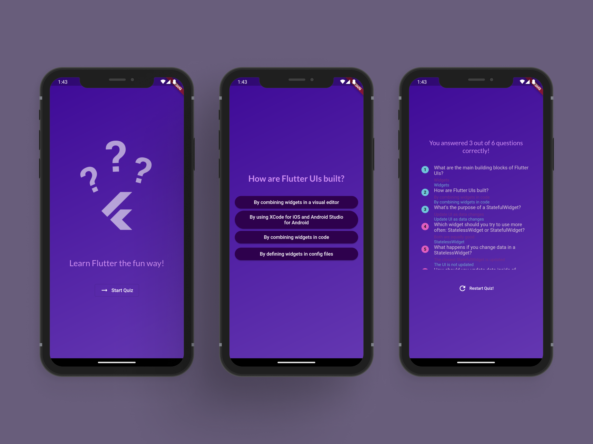

 
  

&#xa0;

<h1 align="center">Flutter Quiz</h1>

  

  

  

  <a href="#dart-sobre">Sobre</a> &#xa0; | &#xa0; 
  <a href="#rocket-tecnologias">Tecnologias</a> &#xa0; | &#xa0;
  <a href="https://github.com/weescoelho" target="_blank">Autor</a>

 

## :dart: Sobre

Projeto desenvolvido no curso de Flutter do Maximilian Schwarzmüller na Udemy.
Consiste em um app simples de perguntas e respostas a respeito do Flutter.

## :rocket: Tecnologias

As seguintes ferramentas foram usadas na construção do projeto:

- [Flutter](https://flutter.dev/)

Feito com :heart: por <a href="https://github.com/weescoelho" target="_blank">Weslley Coelho</a>

&#xa0;

<a href="#top">Voltar para o topo</a>
